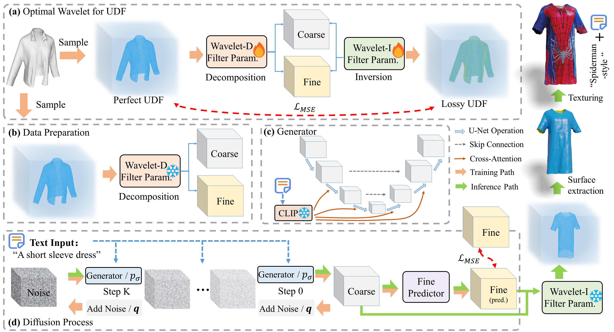
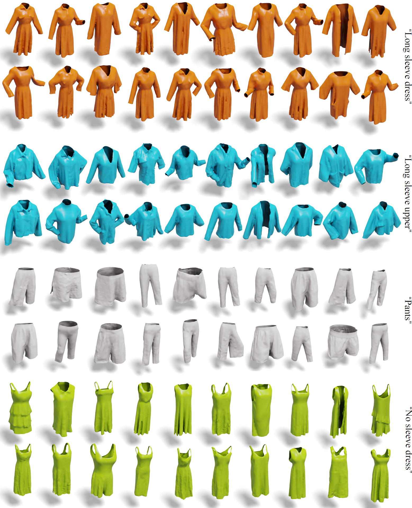
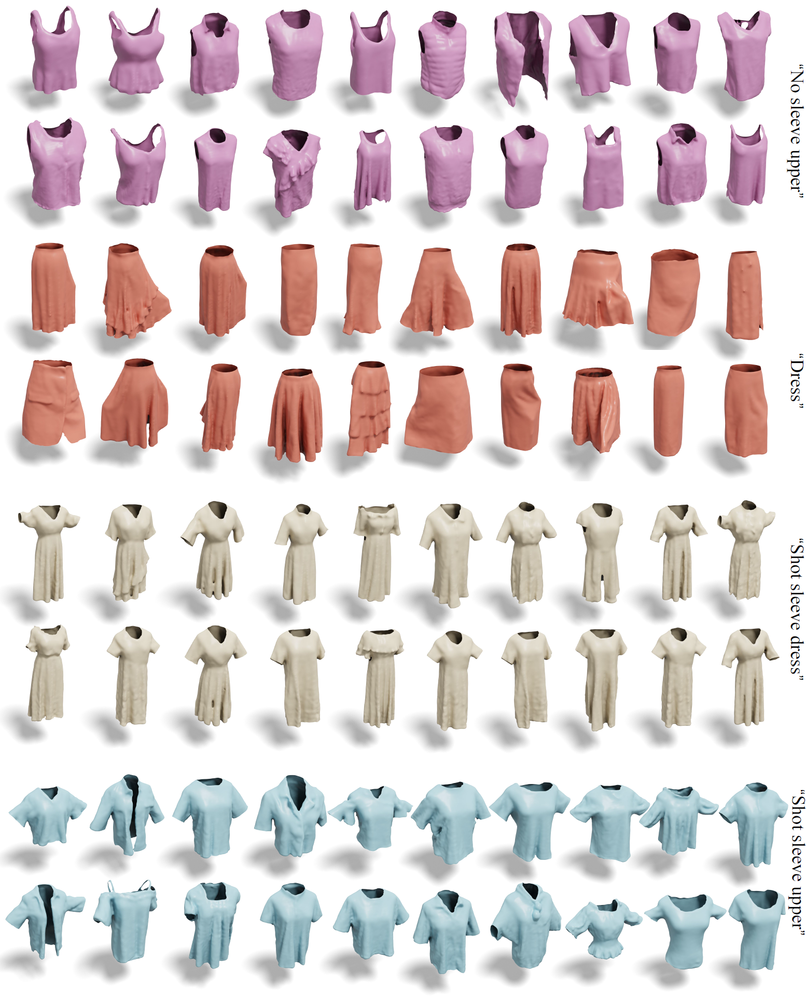
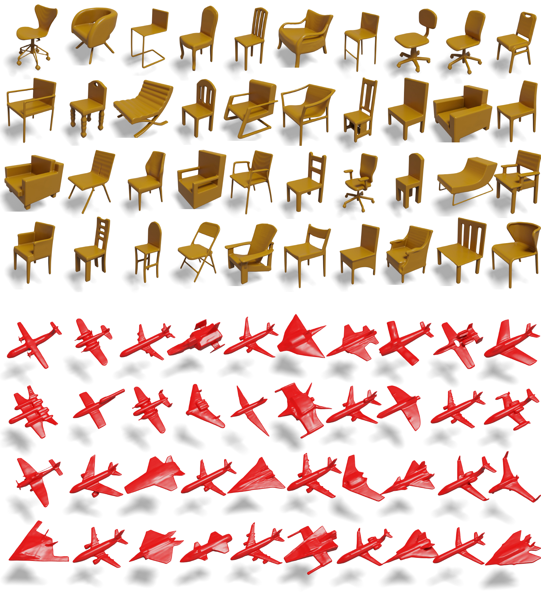
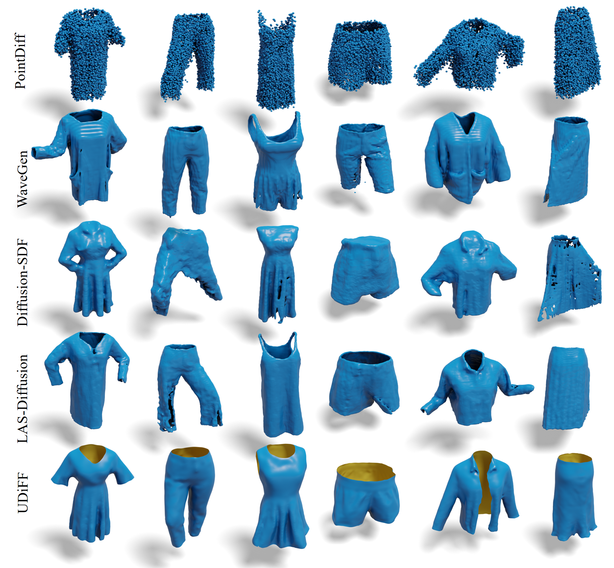
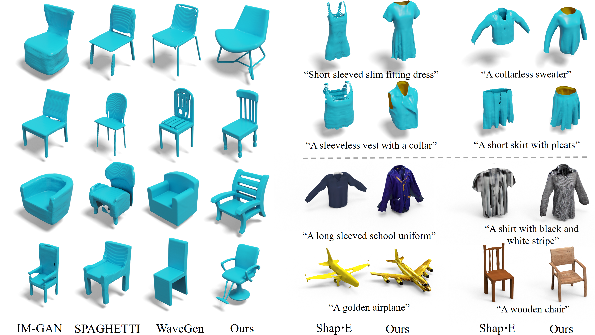

<p align="center">
<h1 align="center">UDiFF: Generating Conditional Unsigned Distance Fields with Optimal Wavelet Diffusion(CVPR 2024)</h1>
<p align="center">
    <a href="https://junshengzhou.github.io/"><strong>Junsheng Zhou*</strong></a>
    ·
    <a href="https://weiqi-zhang.github.io/UDiFF/"><strong>Weiqi Zhang*</strong></a>
    ·
    <a href="https://mabaorui.github.io/"><strong>Baorui Ma</strong></a>
    ·
    <a href="https://dblp.org/pid/261/1098.html"><strong>Kanle Shi</strong></a>
    ·
    <a href="https://yushen-liu.github.io/"><strong>Yu-Shen Liu</strong></a>
    ·
    <a href="https://h312h.github.io/"><strong>Zhizhong Han</strong></a>
</p>
<p align="center"><strong>(* Equal Contribution)</strong></p>
<h3 align="center"><a href="https://arxiv.org/abs/2404.06851">Paper</a> | <a href="https://weiqi-zhang.github.io/UDiFF/">Project Page</a></h3>
<div align="center"></div>
</p>
<p align="center">
    
</p>


We will release the code of the paper <a href="https://arxiv.org/abs/2404.06851">UDiFF: Generating Conditional Unsigned Distance Fields with Optimal Wavelet Diffusion</a> in this repository.

## Abstract

<p>
            In this work, we present UDiFF, a 3D diffusion model for unsigned distance fields (UDFs) which is capable to generate textured 3D shapes with open surfaces from text conditions or unconditionally. Our key idea is to generate UDFs in spatial-frequency domain with an optimal wavelet transformation, which produces a compact representation space for UDF generation. Specifically, instead of selecting an appropriate wavelet transformation which requires expensive manual efforts and still leads to large information loss, we propose a data-driven approach to learn the optimal wavelet transformation for UDFs. 
          </p>

## Method

<p align="center">
  
</p>

<p style="margin-top: 30px">
            <b>Overview of UDiFF.</b> <b>(a)</b> We propose a data-driven approach to attain the optimal wavelet transformation for UDF generation. We optimize wavelet filter parameters through the decomposition and inversion by minimizing errors in UDF self-reconstruction. <b>(b)</b> We fix the learned decomposition wavelet parameters and leverage it to prepare the data as a compact representation of UDFs including pairs of coarse and fine coefficient volumes. <b>(c)</b> is the architecture of the generator in diffusion models, where text conditions are introduced with cross-attentions. <b>(d)</b> The diffusion process of UDiFF. We train the generator to produce coarse coefficient volumes from random noises guided by input texts and train the fine predictor to predict fine coefficient volumes from the coarse ones. 
          </p>

## Visualization Results

### Category Conditional Generations


Outfit Designs with UDiFF Garment Generations


## Generation Results

### DeepFashion3D

​        
​        

<center>Category conditional generations.</center>

### ShapeNet dataset       

<center>Unconditional generations.
</center>

## Comparison Results





## Installation

We recommend creating an [anaconda](https://www.anaconda.com/) environment using our provided `environment.yml`:

```
conda env create -f environment.yml
conda activate udiff
pip install git+https://github.com/fbcotter/pytorch_wavelets
```

## Data Preparation

We use point clouds in the [Deepfashion](https://mmlab.ie.cuhk.edu.hk/projects/DeepFashion.html) dataset.

### Sample UDF

Please modify the `root` path in `sample_udf.py` and run it.

### Learn Wavelet

After sampling the UDF from the point cloud, please run `learn_wavelet/train.py` to train the wavelet parameters.

### Convert Wavelet

Finally, you can run ` convert_wavelet.py`  using the checkpoint trained in the previous step. It should be noted that setting the resolution_index to 3 will generate the coarse wavelet coefficients, whereas setting it to 2 will generate the detail wavelet coefficients.

---

At this point you can start training unconditional, if you need to generate text or image conditions, please refer to [openshape](https://github.com/Colin97/OpenShape_code).

## Training

The process of training is primarily governed by the configuration script (config.py or config_highs.py).

It is essential to define `data_files ` direction to the two npy files that have been created.

- Train diffusion model

  ```
  python trainer/trainer.py --resume_path ./configs/config.py
  ```

- Train detail predictor

  ```
  python trainer/trainer.py --resume_path ./configs/config_highs.py
  ```

## Inference

To execute inference, please modify `models/network_gen.py` by updating the `diffusion_folder` and `high_level_folder`. Additionally, you also need to adjust the `epoch numbers`.

And you can run the following command:

```
python models/network_gen.py
```

If you want to generate high quality textures for generated meshes, please refer to [Text2Tex](https://github.com/daveredrum/Text2Tex).

## Pretrained model

We provide the pretrained models: `learned wavelet`,  `diffusion model` and `detail predictor ` of the unconditional model. Please download the pretrained models from [Google Drive](https://drive.google.com/drive/folders/1T8pnkr3cRKQQmPC3MBZDnIZ0f-z5D1pE?usp=sharing).

## Citation

If you find our code or paper useful, please consider citing

    @inproceedings{udiff,
        title={UDiFF: Generating Conditional Unsigned Distance Fields with Optimal Wavelet Diffusion},
        author={Zhou, Junsheng and Zhang, Weiqi and Ma, Baorui and Shi, Kanle and Liu, Yu-Shen and Han, Zhizhong},
        booktitle={Proceedings of the IEEE/CVF Conference on Computer Vision and Pattern Recognition},
        year={2024}
    }
